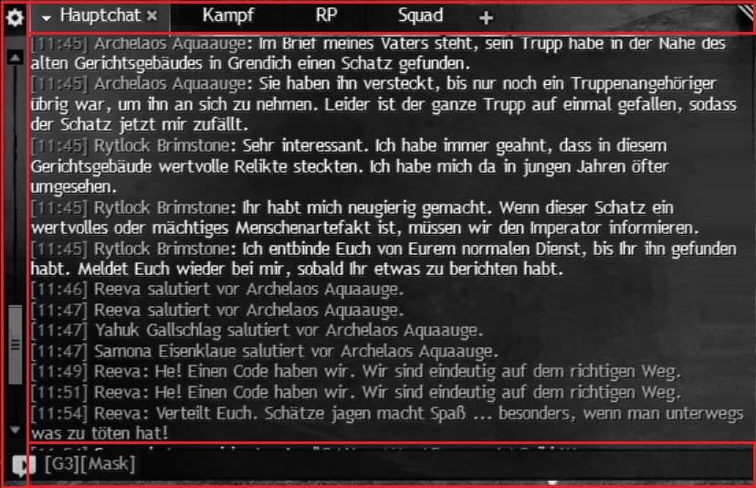
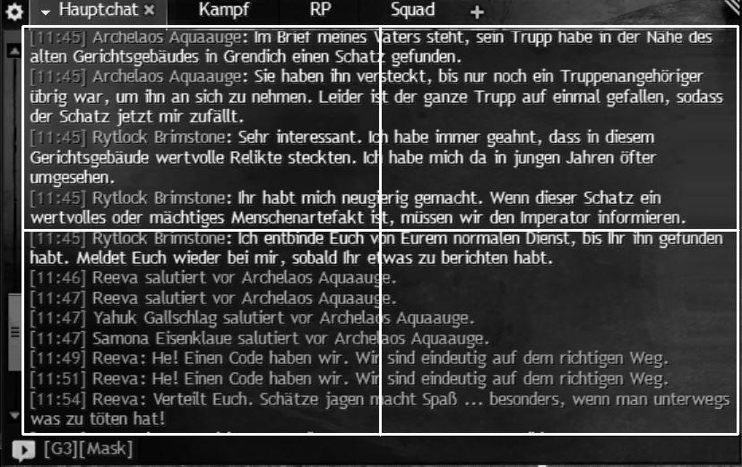

# GW2 Chat logger
## About this application
As in other MMORPGs, Guild Wars 2 allows you to chat with each other. In particular, role players use the chat box to interact with each other. Unfortunately, there is currently no way to save or secure the chat history. It is also currently not possible to copy & paste messages from the chat history. With this application it is possible to log and save chat histories. In particular, it can be used to log the happenings of RP events, store them and read them again later. This application is written in Python3 and uses [Tesseract, Google's OCR engine](https://github.com/tesseract-ocr/tesseract), to convert chat messages into text. The engine is included in the releases, but can also be used via independently [downloaded](https://tesseract-ocr.github.io/tessdoc/Downloads) and, if necessary, installed. 
In the folder where the main.exe is executed, there must be another folder called Tesseract-OCR. The tesseract.exe application is located in it. The language data (tessdata) must also be in this folder.
By default, the logs are saved in C:\Users\User\Documents\Guild Wars 2.
It uses the same path in which the GW2 screenshots are saved by default.

This application is still in development! 

## Recommended settings
- use GW2 in windowed fullscreen
- use GW2 on your primary monitor
- use timestamps in your GW2 chat box
- a bigger font size in the chat may be improve the accuracy

## Accuracy problems
The OCR engine converts the text from the screens into text and tries to deliver the best possible result depending on the settings and optimizations. During the conversion, the engine includes the training data from the tessdata folder and uses neural net (LSTM). It can happen that letters are interpreted differently even if the text remains the same.
The new chatlines are currently being compared with the saved chatlines in order to avoid repetitions. A different interpretation of a character / letter has the consequence that the line is written again with its deviations. 
Accuracy depends on resolution, font size in chat, selected language, included training datas and preprocessing screens of the text.
Sometimes the lines are still misinterpreted.

# Manual - How to use it 
## Control tab
This tab is used to control logging. 
### Record button
Automatically creates a new log file that is used for the entire logging process. Starts logging. The program only takes internal screenshots of the chat from the **active Guild Wars 2 window**. The screens won't be saved. This image is further processed by the OCR engine and the text is extracted from it. Then single chat lines are evaluated from the text and stored in a .txt file. This is done until the stop button is pressed or the application is terminated. Logging is only if Guild Wars 2 is recognized as an active window, as soon as another window becomes active, the logging process is interrupted. It is continued automatically when GW2 is recognized as an active window again. 
### Stop button
Ends the taking of screenshots and the logging, which were started with the record button.
### Try button
Takes a single screenshot of the chat and extracts the text. The text is not saved, but is displayed in the Logger view tab. This can be used to check whether the options for the chat are set correctly and the limits of the chat area are set correctly. Also how long a single image-to-text conversion takes and whether the correct languages ​​are selected.
### Set chat box area button
Take a screenshot of the entire primary monitor. Guild Wars 2 does not have to be the active window. Then another window opens, in which you left-click and draw a rectangle. This rectangle defines the boundaries of the area that was recorded. To start the chat, the rectangle must be drawn over the chat box (see example). You can confirm the result with the SPACE or ENTER key. To cancel the process and close the window, press the C key.

Don't drag the rectangle across the entire chat box. There are three zones in the chat box that negatively affect the result. Make sure you don't select these zones. These three zones are marked as red zones: tab bar, scrolling bar and writing bar. 
   
The rectangle enclosing the text of the chat is white. Draw the edges between the red zones and the beginning of the text. The following picture shows how the white rectangle is set correctly. 
 

### New log session button
Manually creates a new .txt file that is used for logging. (not recommended to use)
## Logger view tab
Currently it only shows the result of the try button. 
## Options tab
In this tab there are various options with which you can set the optimization of text recognition and logging. All options are saved in a settings file. Tab can only be used, if there is no recording active.
 * X1, Y1, X2, Y2 - Are the pixel coordinates of the rectangle in which the recording area is located. Here you can set it manually. It is recommended to set the coordinates via the Set chat box area button. 
	 * X1: X of the upper left corner of the rectangle
	 * Y1: Y of the upper left corner of the rectangle
	 * X2: X of the lower right corner of the rectangle
	 * Y2: Y of the lower right corner of the rectangle 
 * Screenshots per minute (short term: spm): Recording speed. Determines how often the chat is evaluated and new messages are saved in one minute. A higher setting consumes more CPU capacity.
 * Languages: Here you can select the languages ​​to be extracted from the chat. Choosing multiple languages ​​increases the time it takes to convert image to text, but it can increase accuracy.
 * log file location: storage location of the log files.
